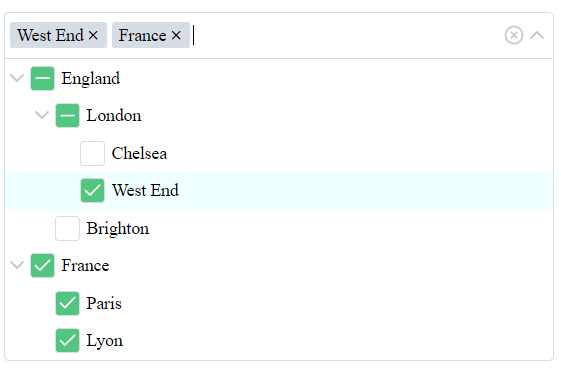

# Treeselect js component

A multi-select js component with nested options.

- Full key support (ArrowUp, ArrowDown, Space, ArrowLeft, ArrowRight, Enter)
- Screen sensitive direction



### Getting Started
It is a js module.

```bash
npm install --save treeselectjs
```
You should import treeselectjs
```
import Treeselect from 'treeselectjs'
```
and css file with styles
```
@import 'treeselectjs/dist/treeselect-js.css'
```

Example
```
import Treeselect from 'treeselectjs/dist/index.js'

const options = [
  {
    name: 'England',
    value: 'England',
    children: [
      {
        name: 'London',
        value: 'London',
        children: [
          {
          name: 'Chelsea',
          value: 'Chelsea',
          children: []
          },
          {
          name: 'West End',
          value: 'West End',
          children: []
          }
        ]
      },
      {
        name: 'Brighton',
        value: 'Brighton',
        children: []
      }
    ]
  },
  {
    name: 'France',
    value: 'France',
    children: [
      {
        name: 'Paris',
        value: 'Paris',
        children: []
      },
      {
        name: 'Lyon',
        value: 'Lyon',
        children: []
      }
    ]
  }
]

const slot = document.createElement('div')
slot.innerHTML='<a class="test" href="">Slot example text</a>'

const domEl = document.querySelector('.treeselect-test')
const treeselect = new Treeselect({
  parentHtmlContainer: domEl,
  value: ['7', '12'],
  options: options,
  alwaysOpen: true,
  appendToBody: true,
  listSlotHtmlComponent: slot,
  disabled: false,
  emptyText: 'No data text'
})

treeselect.srcElement.addEventListener('input', (e) => {
  console.log(e.detail)
})
```

### Props
Name  | Type (default) | Discription
------------- | ------------- | -------------
parentHtmlContainer  | HTMLElement | It sould be a HTML element (div), it will be changed to the list container.
value  | Array[String] ([]) | It is an array with ids.
options  | Array[Object] ([]) | It is an array of objects { name: String, value: String, children: [] }, where children are the same array of objects.
openLevel  | Number (0) | All groups will be opened to this level.
appendToBody  | Boolean (false) | List will be appended to the body instead of the input container.
alwaysOpen  | Boolean (false) | List will be always opened.
showTags  | Boolean (true) | Selected values look like tags. The false value shows results as '{count} elements selected'.
clearable  | Boolean (true) | Clear icon is available.
searchable  | Boolean (true) | Search is available.
placeholder  | String ('Search...') | Placeholder text.
grouped | Boolean (true) | Show groups in the input and group lefs if all group selected.
listSlotHtmlComponent | HTMLElement (null) | It should be a HTML element, it will be append to the end of the list.
disabled | Boolean (false) | List will be disabled.
emptyText | String ('No results found...') | A empty list text.

### Emits
Name  | Return Type | Discription
------------- | ------------- | -------------
input  | Array[String] | Returns selected ids without groups, only leafs.

### Methods
Name  | Params | Discription
------------- | ------------- | -------------
updateValue  | Array[String] | Update selected values.
mount  | None | Helps to remount and update settings.